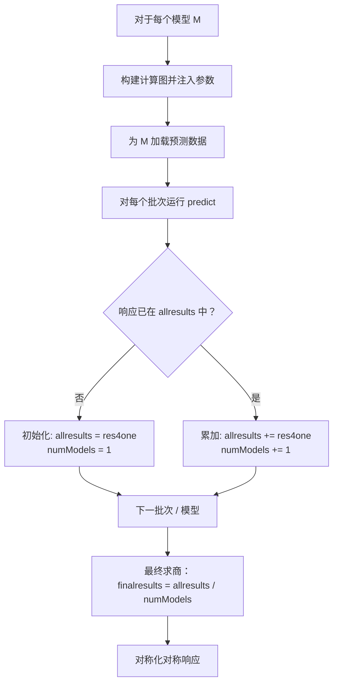
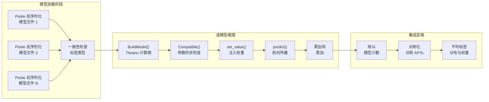

---
slug:8-model-loading-and-ensemble-averaging
blog_type:normal
---

DL4DistancePrediction2 的推理流水线依赖于两个互锁机制：**将一个或多个训练好的模型快照从磁盘反序列化为活跃的 Theano 计算图**，以及**将它们各自的响应概率矩阵聚合为一个单一的均值预测**。这两个机制共同将一组独立训练的 ResNet 检查点转化为一个稳健的集成预测器，其输出是目标蛋白质中每个残基对的统一距离概率分布。

来源：[run_distance_predictor.py](run_distance_predictor.py#L24-L242), [Model4DistancePrediction.py](Model4DistancePrediction.py#L606-L656)

## 模型文件格式与反序列化

每个训练好的模型以包含字典的 **Python pickle** (`.pkl`) 形式持久化存储。该字典的键构成了重建网络和重现预测所需的完整规范：

| 键 | 类型 | 用途 |
|---|---|---|
| `network` | `str` | 架构标识符（如 `'DilatedResNet2D'`, `'ResNet2DV23'`） |
| `responses` | `list[str]` | 该模型预测的响应名称（如 `['CbCb_Discrete25C']`） |
| `paramValues` | `list[np.ndarray]` | 每一层的习得权重/偏置数组 |
| `n_in_seq` | `int` | 预期的序列特征维度 |
| `n_in_matrix` | `int` | 预期的成对（矩阵）特征维度 |
| `n_in_embed` | `int` | 预期的嵌入特征维度（若使用） |
| `labelRefProbs` | `dict` | 每个响应的参考标签概率分布 |
| `weight4labels` | `dict` | 每个响应的标签加权方案 |

加载过程是直接进行 pickle 反序列化，并设置 `encoding='latin1'` 以处理旧版模型文件的 Python 2/3 跨版本兼容性问题。通过 `--model` 命令行参数可接受多个模型路径，以分号分隔，每个模型独立加载至 `models` 列表中。

来源：[run_distance_predictor.py](run_distance_predictor.py#L27-L31), [run_distance_predictor.py](run_distance_predictor.py#L281-L285), [config.py](config.py#L16-L16)

## 跨模型一致性验证

在任何推理执行前，流水线会验证**所有已加载模型对每种原子对类型的标签类型保持一致**。对于每个模型及其每个响应，通过 `Response2LabelName` 和 `Response2LabelType` 提取标签名（如 `CbCb`）和标签类型（如 `Discrete25C`）。若两个模型对同一原子对类型分配了不同的标签类型，程序将发出警告并退出——混合不兼容的模型会产生无意义的平均输出。

来源：[run_distance_predictor.py](run_distance_predictor.py#L35-L46), [config.py](config.py#L93-L97)

## 计算图重建与参数注入

对于每个模型，推理流水线执行三步重建：

1. **构建 Theano 计算图** — `BuildModel(model, forTrain=False)` 根据模型的规范字典实例化一个 `ResNet4DistMatrix` 对象。当 `forTrain=False` 时，不创建标签或权重 Theano 变量；仅连接输入变量（`x`, `y`, `xmask`, `ymask` 以及可选的 `xem`）和输出概率张量（`distancePredictor.output_prob`）。随后，从输入到 `output_prob` 编译得到 Theano 函数 `predict`。

2. **验证参数兼容性** — `Compatible()` 将新建图中每个 Theano 共享变量的形状和类型，与模型 `paramValues` 中对应的 `np.ndarray` 进行比较。若不匹配，说明模型文件是使用不同的架构训练的，程序将致命错误退出。

3. **注入习得参数** — `[p.set_value(v) for p, v in zip(distancePredictor.params, model['paramValues'])]` 将保存的权重复制到活跃图的共享变量中，完成从未经训练的骨架到全副武装的预测器的转变。

来源：[run_distance_predictor.py](run_distance_predictor.py#L56-L78), [Model4DistancePrediction.py](Model4DistancePrediction.py#L606-L656), [utils.py](utils.py#L129-L143)

## 逐模型推理与累加策略

集成平均设计在利用多个深度模型预测多个蛋白质时优先考虑**内存效率**。流水线并未存储每个模型的完整预测张量并在最后求平均，而是采用**累加和累加**模式：

核心数据结构为：

- **`allresults[name][response]`** — 针对给定蛋白质和响应，跨模型的概率矩阵累加和
- **`numModels[name][response]`** — 对每个 (蛋白质, 响应) 对产生贡献的模型计数

这一点至关重要，因为两个不同的模型可能预测**不同子集的响应**（存在重叠但不完全相同）。计数器 `numModels` 精确记录了对每个特定响应产生贡献的模型数量，确保在模型响应覆盖范围不统一时也能正确求商。源码中的注释明确指出了这一设计选择：*"此处我们仅保存总和以降低内存消耗，当使用多个深度模型预测大量蛋白质时，内存消耗可能极其巨大。"*

来源：[run_distance_predictor.py](run_distance_predictor.py#L54-L142)

## 掩码移除与结果切片

每个批次的蛋白质会被填充至统一的序列长度，以供 Theano 进行批处理。预测完成后，通过从掩码计算真实序列长度 (`seqLens`) 并进行切片来剥离填充区域：`probMatrix[maxSeqLen-seqLen:, maxSeqLen-seqLen:, :]`。这移除了零填充的行与列，仅保留每个蛋白质有效的 L×L 概率子矩阵。

此外，输出张量的最后一维拼接了模型中**所有响应**的预测结果。通过 `responseProbDims` 的累加和计算每个响应的起始和结束位置，从而独立提取各响应的切片：`result[:, :, :, start:end]`。

来源：[run_distance_predictor.py](run_distance_predictor.py#L110-L133), [config.py](config.py#L120-L138)

## 最终平均与对称化

所有模型处理完毕后，累加和将除以各自的模型计数：

| 步骤 | 操作 | 原理 |
|---|---|---|
| 集成平均 | `allresults[name][response] / numModels[name][response]` | 贡献模型的简单算术平均 |
| 对称化 | 针对对称原子对类型执行 `(M + Mᵀ) / 2` | `CbCb`, `CaCa`, `CgCg` 和 `Beta` 的距离矩阵在物理上是对称的；与转置矩阵进行平均可降低噪声并略微提升精度 |

对称化根据 `config.IsSymmetricAPT()` 条件执行，该函数检查原子对类型是否属于对称集合 `{CbCb, CaCa, CgCg, Beta}`。如 `CaCg` 和 `NO`（N-O 氢键）等非对称响应则保持原样。

来源：[run_distance_predictor.py](run_distance_predictor.py#L149-L167), [config.py](config.py#L24-L35)

## 标签分布与权重的集成平均

除概率矩阵外，还有两个逐模型量在集成过程中被平均：

- **`finalLabelDistributions[apt]`** — 各模型 `labelRefProbs[response]` 的平均，代表距离区间上的共识参考概率分布
- **`finalLabelWeights[apt]`** — 各模型 `weight4labels[response]` 的平均，代表共识标签加权方案

这些平均量与预测矩阵一同存储在输出文件中，并在后续的距离到接触转换和评估阶段使用。

来源：[run_distance_predictor.py](run_distance_predictor.py#L168-L188)

## 模型间的垃圾回收

在每个模型的预测累加完成后，流水线会显式删除 `predict` 函数、`predData` 及 `predSeqData`，然后调用 `gc.collect()`。此步骤不可或缺，因为 Theano 编译的函数和大型 NumPy 数组会占用大量内存，若不显式清理，在处理大型蛋白质集时顺序处理多个模型将面临内存溢出风险。

来源：[run_distance_predictor.py](run_distance_predictor.py#L144-L147)

## 完整流水线流程

<CgxTip>累加和累加模式 (`allresults += res4one`) 是一种刻意的内存优化。存储所有 N 个模型关于 M 个蛋白质的完整预测张量将需要 O(N × M × L² × D) 的内存。累加和将其压缩至 O(M × L² × D)，与集成规模无关，代价是丢失了各模型的独立预测。若你需要各模型输出以进行不确定性估计，则必须修改累加循环以单独存储每个模型的结果。</CgxTip>

<CgxTip>向现有集成中添加新模型时，请确保其 `responses` 列表与其他模型兼容。两个模型可以预测不同的响应子集（例如，一个预测 `CbCb_Discrete25C` + `CaCa_Discrete25C`，而另一个仅预测 `CbCb_Discrete25C`），流水线能通过逐响应计数正确处理此情况。然而，两个模型绝不能对同一原子对类型分配不同的标签类型。</CgxTip>

## 后续步骤

集成平均完成后，统一的概率矩阵将流入**距离到接触转换**步骤，在此步骤中，距离区间上的连续概率分布被折叠为二值接触预测。此转换——以及最终 6 元组结果的序列化——将在 [距离到接触转换](9-distance-to-contact-conversion) 和 [结果序列化格式](10-result-serialization-format) 中介绍。