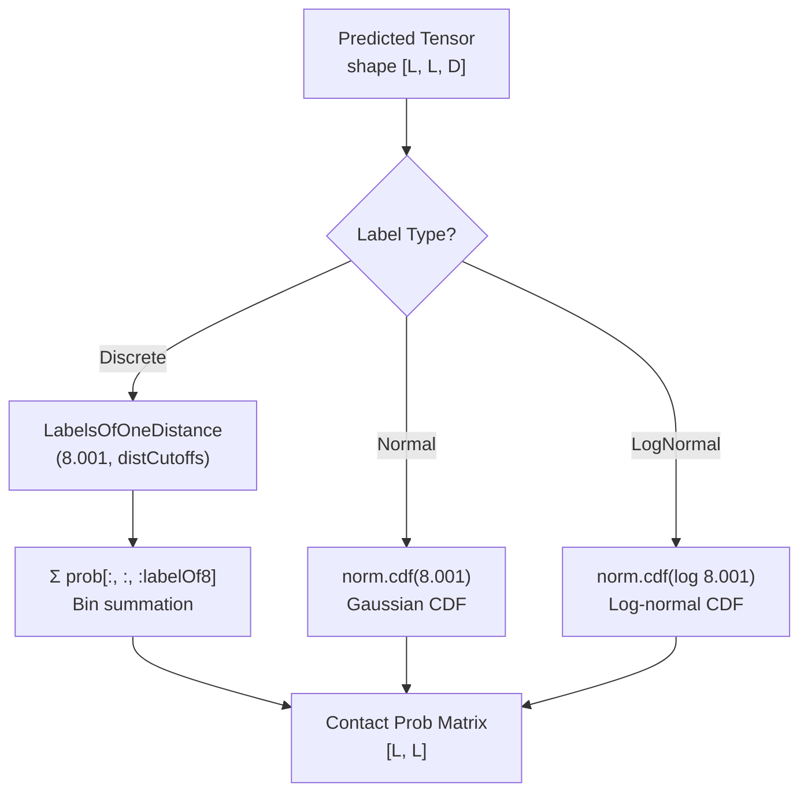
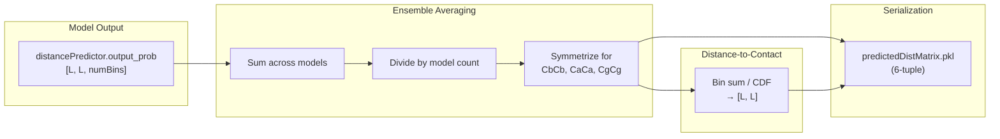

---
slug:9-distance-to-contact-conversion
blog_type:normal
---


距离到接触的转换是推理阶段的关键变换，它将细粒度的距离概率分布坍缩为二值的接触概率图。在本项目中，**接触**被定义为任何 Cβ–Cβ 距离低于 8.001 Å 的残基对（即 `ContactDefinition` 常量）。模型从不直接预测接触——它预测的是距离概率分布——因此，该转换是从模型的原生输出通往下游评估和 CASP 提交流水线所使用的接触图的桥梁。

来源：[config.py](config.py#L175-L176), [ContactUtils.py](ContactUtils.py#L187-L200)

## 核心函数：`Distance2Contact`

规范的转换逻辑位于 `ContactUtils.Distance2Contact` 中。它接受形状为 `[L, L, numBins]` 的 3D 距离概率张量（其中 *L* 为序列长度，*numBins* 为距离离散化区间数），并返回形状为 `[L, L]` 的 2D 接触概率矩阵。该操作是对所有距离边界低于接触阈值的区间执行简单而严谨的**边际求和**：

```python
def Distance2Contact(distProb, labelOf8=1):
    contactProb = np.sum( distProb[:, :, :labelOf8], axis=2)
    return contactProb
```

参数 `labelOf8` 是接触截断值在距离离散化方案中的**区间索引**。例如，在 `25C` 方案（跨越 4.5–16.0 Å 的 25 个区间）中，`labelOf8` 由 `DistanceUtils.LabelsOfOneDistance(8.001, distCutoffs['25C'])` 计算得出，该函数使用 `np.digitize` 来寻找上限边界 ≤ 8.001 Å 的最大区间索引。这确保了对区间 `0` 到 `labelOf8 - 1` 进行求和，能精确捕获分配给接触范围内距离的概率质量。

来源：[ContactUtils.py](ContactUtils.py#L190-L200), [DistanceUtils.py](DistanceUtils.py#L235-L237)

## 推理流水线中的三种转换策略

虽然 `Distance2Contact` 提供了离散标签路径，但 `run_distance_predictor.PredictDistMatrix` 中的完整推理流水线根据模型的输出标签类型，实现了**三种不同的转换策略**。下图展示了相同的预测张量如何被路由到不同的转换逻辑：



下表总结了每种策略：

| 标签类型 | 方法 | 公式 | 核心代码 |
|---|---|---|---|
| **Discrete**（例如 `25C`, `13C`） | 区间边际求和 | P(contact) = Σ P(d ∈ bin_k)，对于所有满足 cutoff_k < 8.001 Å 的区间 k | `np.sum(result[:, :, :labelOf8], axis=2)` |
| **Normal** | 高斯 CDF | P(contact) = Φ((8.001 − μ) / σ) | `norm(loc=μ, scale=σ).cdf(8.001)` |
| **LogNormal** | 对数正态 CDF | P(contact) = Φ((log 8.001 − μ) / σ) | `norm(loc=μ, scale=σ).cdf(log(8.001))` |

<CgxTip>对于 Normal 和 LogNormal 路径，预测张量的最后一维包含**两个**参数（μ 和 σ），而不是完整的概率向量。随后 `scipy.stats.norm` 的 CDF 会评估（对数）距离低于接触阈值的累积概率——这在数学上等价于离散区间求和，但操作的是连续分布。</CgxTip>

来源：[run_distance_predictor.py](run_distance_predictor.py#L200-L218)

## 如何确定 `labelOf8`

离散转换的关键在于正确识别边界索引 `labelOf8`。函数 `DistanceUtils.LabelsOfOneDistance(d, cutoffs)` 封装了 `np.digitize`，返回满足 `cutoffs[i] ≤ d` 的最大索引 *i*。对于标准的 `25C` 方案：

```python
distCutoffs['25C'] = [0, 4.5, 5.09, 5.68, ..., 8.27, ..., 16.0]
# labelOf8 = LabelsOfOneDistance(8.001, distCutoffs['25C'])  →  例如，8
```

这意味着区间 0 到 7（即 `:8`）都代表低于 8.001 Å 的距离，对它们的概率求和即可得到总接触概率。`ContactDefinition` 被设定为 **8.001** 而非精确的 8.0，是为了避免与 `8.0` 等常见区间边界产生浮点数边界歧义。

来源：[DistanceUtils.py](DistanceUtils.py#L235-L237), [config.py](config.py#L62-L71), [config.py](config.py#L175-L176)

## 特殊情况：HB 和 Beta 原子对

氢键（HB）和 β 配对（Beta）的预测不通过距离到接触的流水线进行转换。由于这些是**二分类**输出（接触与非接触），预测概率张量的第一个通道被直接用作接触概率：

```python
elif apt in ['HB', 'Beta']:
    predictedContactMatrices[name][apt] = finalresults[name][response][:, :, 0]
```

此绕过操作是必要的，因为 HB 和 Beta 使用各自独立的距离截断值（分别为 `MaxHBDistance = 9.5` Å 和 `MaxBetaDistance = 8.0` Å）以及各自的 2 区间标签方案（`distCutoffs_HB['2C']`），这使得标准的距离区间求和变得多余。

来源：[run_distance_predictor.py](run_distance_predictor.py#L220-L221), [config.py](config.py#L55-L56), [config.py](config.py#L88-L90)

## 用于 CASP 提交的概率缩放

当接触预测通过 `ContactUtils.SaveContactMatrixInCASPFormat` 以 CASP RR 格式保存时，原始接触概率会被 `ProbScaleFactor = log(0.5) / log(0.4) ≈ 0.76` 进行**幂次缩放**。这会将概率 *p* 变换为 *p*^0.76，从而展宽概率值分布，使得标准的 0.5 二值阈值能产生更好的 MCC 和 F1 分数。此缩放**仅**在生成 CASP 文件时应用——它不会影响存储的 `.predictedDistMatrix.pkl` 结果或内部的准确率计算。

来源：[ContactUtils.py](ContactUtils.py#L106-L111), [config.py](config.py#L4-L9)

## 端到端数据流

下图展示了从模型输出到转换再到最终序列化的完整数据流：



序列化的 `.predictedDistMatrix.pkl` 文件存储了一个 6 元组：`(proteinName, sequence, distProbMatrix, contactProbMatrix, labelWeights, labelDistributions)`。索引 3 处的接触概率矩阵正是 `BatchEvaluateContactAccuracy.py` 等下游脚本在评估接触准确率时直接读取的内容，从而避免了重新计算转换。

<CgxTip>预测的距离概率矩阵（索引 2）和预测的接触矩阵（索引 3）都存储在同一个 PKL 文件中。消费这些文件的脚本通过文件后缀来选择使用哪个矩阵：`.predictedDistMatrix.pkl` 加载 `pred[3]` 用于接触评估，而 `.predictedContactMatrix.pkl` 加载 `pred['predContactMatrix']`。</CgxTip>

来源：[run_distance_predictor.py](run_distance_predictor.py#L226-L242), [BatchEvaluateContactAccuracy.py](BatchEvaluateContactAccuracy.py#L76-L84)

## 转换后的对称化

对于对称的原子对类型（CbCb, CaCa, CgCg, Beta），预测的距离概率矩阵在接触转换**之前**，会通过与自身的转置取平均进行对称化：`result = (result + result.T) / 2`。由于区间求和与 CDF 操作均为逐元素运算，这种对称性在转换过程中得以保留，从而确保了这些原子类型的 `contactProb[i, j] == contactProb[j, i]`。

来源：[run_distance_predictor.py](run_distance_predictor.py#L163-L167)

## 接下来去哪

此转换生成的接触概率矩阵将被评估流水线消费。若要了解如何对这些输出进行准确率测量，请参阅[接触预测准确率](13-contact-prediction-accuracy)和[MCC 与 F1 指标](15-mcc-and-f1-metrics)。有关同时存储距离和接触预测的序列化格式的详细信息，请参阅[结果序列化格式](10-result-serialization-format)。